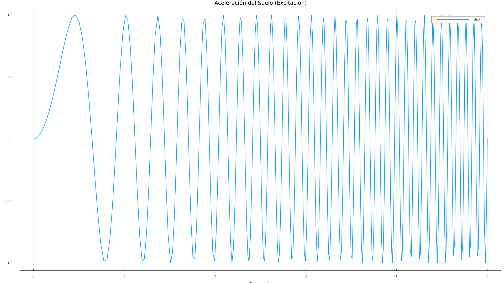

# Análisis Dinámico de una Estructura Tipo Edificio de 3 Pisos

**Autores:** Kalev Pineda, Josue Sarate

## 1. Desarrollo Matemático

Se analiza el comportamiento dinámico de una estructura de tres pisos sometida a una excitación en la base, como la provocada por un sismo. El modelo matemático se obtiene mediante el formalismo de Euler-Lagrange.

### 1.1. Sistema Físico y Coordenadas
El sistema consta de tres masas (`m₁, m₂, m₃`) conectadas por elementos elásticos (resortes `k₁, k₂, k₃`) y disipativos (amortiguadores `c₁, c₂, c₃`). La base de la estructura experimenta un movimiento `z(t)`.

Las coordenadas generalizadas `x₁(t), x₂(t), x₃(t)` representan los desplazamientos relativos de cada piso con respecto a la base.

### 1.2. Ecuaciones de Movimiento
Utilizando el formalismo de Euler-Lagrange, se derivan las ecuaciones de movimiento, que se pueden expresar en forma matricial como:

$$
M \ddot{\mathbf{x}}(t) + C \dot{\mathbf{x}}(t) + K \mathbf{x}(t) = \mathbf{F}(t)
$$

Donde:
- $\mathbf{x} = [x_1, x_2, x_3]^T$ es el vector de desplazamientos relativos.
- **Matriz de Masa (M):**
$$
M = \begin{bmatrix} m_1 & 0 & 0 \\ 0 & m_2 & 0 \\ 0 & 0 & m_3 \end{bmatrix}
$$
- **Matriz de Amortiguamiento (C):**
$$
C = \begin{bmatrix} c_1+c_2 & -c_2 & 0 \\ -c_2 & c_2+c_3 & -c_3 \\ 0 & -c_3 & c_3 \end{bmatrix}
$$
- **Matriz de Rigidez (K):**
$$
K = \begin{bmatrix} k_1+k_2 & -k_2 & 0 \\ -k_2 & k_2+k_3 & -k_3 \\ 0 & -k_3 & k_3 \end{bmatrix}
$$
- **Vector de Fuerza de Excitación (F(t)):** La fuerza es inducida por la aceleración del suelo $\ddot{z}(t)$.
$$
\mathbf{F}(t) = -M \begin{bmatrix} 1 \\ 1 \\ 1 \end{bmatrix} \ddot{z}(t)
$$

## 2. Solución Numérica en Julia

Para resolver este sistema de ecuaciones diferenciales ordinarias (EDOs) de segundo orden, se convierte a un sistema de primer orden y se utiliza el paquete `DifferentialEquations.jl` en Julia.

El estado del sistema se define como $\mathbf{u} = [\mathbf{x}^T, \dot{\mathbf{x}}^T]^T$. La EDO de primer orden es:
$$
\dot{\mathbf{u}}(t) = \begin{bmatrix} \dot{\mathbf{x}} \\ \ddot{\mathbf{x}} \end{bmatrix} = \begin{bmatrix} \dot{\mathbf{x}} \\ M^{-1}(\mathbf{F}(t) - C\dot{\mathbf{x}} - K\mathbf{x}) \end{bmatrix}
$$

El código en Julia implementa esta lógica, define los parámetros físicos tomados del paper de referencia, y resuelve la EDO para un intervalo de tiempo de 100 segundos.

# Análisis Dinámico de una Estructura Tipo Edificio de 3 Pisos

**Autores:** Kalev Pineda, Josue Sarate

## 1. Desarrollo Matemático

El comportamiento dinámico de una estructura de tres pisos sometida a una excitación en la base se modela usando el formalismo de Euler-Lagrange. Las coordenadas generalizadas `x₁(t)`, `x₂(t)`, y `x₃(t)` representan los desplazamientos relativos de cada piso con respecto a la base móvil.

El sistema de ecuaciones de movimiento resultante se expresa en forma matricial:

$$
M \ddot{\mathbf{x}}(t) + C \dot{\mathbf{x}}(t) + K \mathbf{x}(t) = \mathbf{F}(t)
$$

Donde:
- $\mathbf{x} = [x_1, x_2, x_3]^T$ es el vector de desplazamientos relativos.
- **Matrices del Sistema:** Las matrices de Masa (M), Amortiguamiento (C) y Rigidez (K) se ensamblan a partir de los parámetros físicos del sistema.
- **Vector de Fuerza de Excitación:** La fuerza es inducida por la aceleración del suelo $\ddot{z}(t)$:
$$
\mathbf{F}(t) = -M \begin{bmatrix} 1 \\ 1 \\ 1 \end{bmatrix} \ddot{z}(t)
$$

## 3. Solución Numérica y Parámetros

La simulación se realizó en Julia utilizando el paquete `DifferentialEquations.jl`. Los parámetros del modelo, extraídos de la Tabla 1 del paper de referencia, son:

- **Masas (kg):** `m₁ = 1.018`, `m₂ = 1.001`, `m₃ = 2.187`
- **Rigideces (N/m):** `k₁ = 897.0277`, `k₂ = 933.3893`, `k₃ = 888.2334`
- **Amortiguamiento (Ns/m):** `c₁ = 0.1233`, `c₂ = 0.3345`, `c₃ = 1.8977`

La excitación del suelo es una señal tipo "chirp" (barrido de frecuencia) definida por:
- **Amplitud:** 1.0 m/s²
- **Rango de Frecuencia:** 0.0 Hz a 6.0 Hz
- **Duración:** 5.0 segundos

## 4. Explicación del Comportamiento (Análisis de Gráficas)

### Gráfica 1: Aceleración del Suelo (Excitación)

Esta gráfica muestra la señal de entrada aplicada a la base de la estructura. Es una onda senoidal cuya frecuencia aumenta linealmente con el tiempo, comenzando en 0 Hz y terminando en 6 Hz a los 5 segundos. Las oscilaciones son lentas al principio y se vuelven progresivamente más rápidas. Este tipo de excitación es excelente para identificar las frecuencias de resonancia del sistema, que son aquellas donde la estructura responde con mayor amplitud.

### Gráfica 2: Desplazamientos Relativos de los Pisos

Esta es la gráfica más importante para entender la respuesta de la estructura:
- **Efecto de Amplificación ("Efecto Látigo"):** Se observa claramente que la amplitud del desplazamiento aumenta con la altura. La curva verde (Piso 3, `x₃`) tiene la mayor amplitud, seguida por la roja (Piso 2, `x₂`) y la azul (Piso 1, `x₁`). Esto significa que el piso superior es el que sufre los mayores desplazamientos y, por tanto, el mayor riesgo.
- **Fenómeno de Resonancia:** Alrededor del segundo `t=1.5`, la amplitud de las oscilaciones aumenta drásticamente, alcanzando su punto máximo. Esto es la **resonancia**. Ocurre porque la frecuencia de la excitación en ese instante ha coincidido con la primera frecuencia natural de vibración de la estructura. Durante la resonancia, el desplazamiento del tercer piso alcanza casi **4 cm**, una amplitud significativamente mayor que en otros momentos.
- **Forma Modal:** Durante el pico de resonancia, las tres curvas se mueven en fase (suben y bajan juntas). Este comportamiento es característico del **primer modo de vibración** de la estructura.

### Gráfica 3: Velocidades Relativas de los Pisos

El comportamiento de las velocidades es análogo al de los desplazamientos.
- Las velocidades también se amplifican con la altura del piso, siendo máximas en el tercer piso.
- Los picos de velocidad más altos ocurren durante el mismo período de resonancia (alrededor de `t=1.5s`), lo que indica que durante la resonancia no solo los desplazamientos son grandes, sino también las fuerzas inerciales y las de disipación de energía.

### Gráfica 4: Diagrama de Fase (Piso 3)

Este diagrama muestra la relación entre el desplazamiento (`x₃`) y la velocidad (`ẋ₃`) del piso más crítico.
- **Evolución del Estado:** La trayectoria comienza en el origen (reposo) y evoluciona en espiral hacia afuera.
- **Bucles de Resonancia:** Los bucles más grandes y amplios en la espiral corresponden exactamente al momento en que el sistema está en resonancia. En este estado, tanto el desplazamiento como la velocidad alcanzan sus valores máximos, lo que refleja un estado de alta energía en el sistema.
- **Efecto del Amortiguamiento:** La trayectoria no diverge indefinidamente, sino que se mantiene contenida en una región. Esto es una demostración visual del efecto del **amortiguamiento** (`C`). Disipa la energía introducida por la excitación, evitando que las amplitudes crezcan sin control y llevando al sistema a un comportamiento estable (un atractor de ciclo límite) para esta excitación específica.