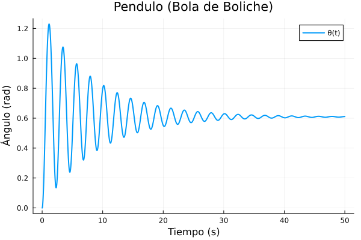
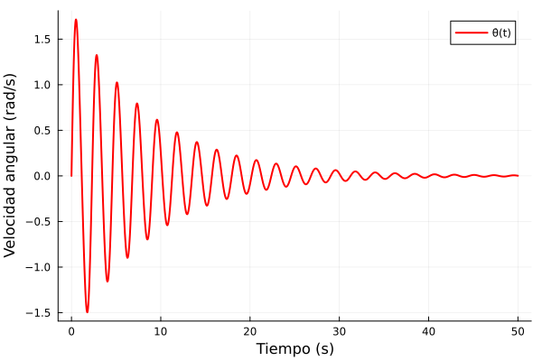
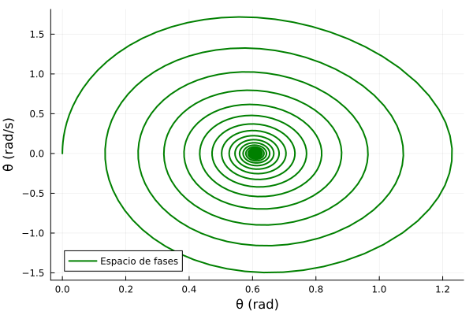

# Péndulo Simple (No Conservativo)

**Autor:** Kalev
**Fecha:** 5 Junio 2025

**Resumen:**
Este trabajo presenta un análisis del péndulo simple, un sistema físico fundamental, extendiendo su estudio para incluir efectos no conservativos como el amortiguamiento viscoso y un torque externo constante. Se deriva la ecuación de movimiento utilizando el formalismo de Euler-Lagrange. Posteriormente, se describe una simulación numérica implementada en el lenguaje de programación Julia, utilizando el paquete `DifferentialEquations.jl`, para resolver la ecuación diferencial resultante. Se analizan gráficamente los resultados de la simulación para un caso específico (una bola de boliche) y se comparan diferentes escenarios de amortiguamiento y torque.

---

# Introducción

El péndulo simple es un modelo idealizado que consiste en una masa puntual $m$ suspendida de un hilo inextensible de longitud $l$ y masa despreciable, que oscila en un plano vertical bajo la influencia de la gravedad $g$. A pesar de su simplicidad, el péndulo simple es un sistema paradigmático en la física, utilizado para ilustrar conceptos de movimiento armónico simple (para pequeñas oscilaciones), conservación de energía y dinámica no lineal.

En sistemas reales, raramente se encuentran las condiciones ideales. Las fuerzas de fricción, como la resistencia del aire, introducen amortiguamiento, disipando energía y causando que las oscilaciones decaigan con el tiempo. Adicionalmente, pueden actuar fuerzas externas, como un motor aplicando un torque, que inyectan energía al sistema. Este estudio se enfoca en un péndulo simple no conservativo, donde se considera tanto un coeficiente de amortiguamiento viscoso $b$ como un torque externo constante $T_{\text{ext}}$.

# Desarrollo Matemático: Formalismo de Euler-Lagrange

Para obtener la ecuación de movimiento del péndulo, utilizaremos el formalismo de Euler-Lagrange. La coordenada generalizada que describe el estado del sistema es el ángulo $\theta$ que forma el hilo del péndulo con la vertical.

## Energía Cinética

La velocidad tangencial de la masa $m$ es $v = l \dot{\theta}$, donde $\dot{\theta} = d\theta/dt$ es la velocidad angular. La energía cinética $K$ del sistema es:
```math
K = \frac{1}{2} m v^2 = \frac{1}{2} m (l \dot{\theta})^2 = \frac{1}{2} m l^2 \dot{\theta}^2 \quad (1)
```


## Energía Potencial

Tomando el punto más bajo de la trayectoria ($\theta=0$) como el nivel de referencia para la energía potencial gravitatoria ($U_g=0$), la altura de la masa $m$ sobre este punto es $h = l(1 - \cos\theta)$. Por lo tanto, la energía potencial $U_g$ es:
$$
U_g = mgh = mgl(1 - \cos\theta) \quad (2)
$$
Alternativamente, si definimos $U_g=0$ cuando $\theta = \pi/2$, entonces $U_g = -mgl\cos\theta$. Ambas definiciones son válidas y conducen a la misma ecuación de movimiento, ya que solo las derivadas de la energía potencial importan. Usaremos $U_g = -mgl\cos\theta$ para simplificar el Lagrangiano.

## Lagrangiano

El Lagrangiano $\mathcal{L}$ del sistema se define como la diferencia entre la energía cinética y la energía potencial:
$$
\mathcal{L} = K - U_g = \frac{1}{2} m l^2 \dot{\theta}^2 - (-mgl\cos\theta) = \frac{1}{2} m l^2 \dot{\theta}^2 + mgl\cos\theta \quad (3)
$$

## Fuerzas Generalizadas No Conservativas

Las fuerzas no conservativas que actúan sobre el sistema son:
-   Torque de amortiguamiento viscoso: $\tau_b = -b \dot{\theta}$, donde $b$ es el coeficiente de amortiguamiento. El signo negativo indica que se opone al movimiento.
-   Torque externo: $T_{\text{ext}}$, que se asume constante.

La fuerza generalizada no conservativa $Q_{nc}$ correspondiente a la coordenada $\theta$ es la suma de estos torques:
$$
Q_{nc} = T_{\text{ext}} - b \dot{\theta} \quad (4)
$$

## Ecuación de Euler-Lagrange

La ecuación de Euler-Lagrange para un sistema con fuerzas no conservativas es:
$$
\frac{d}{dt}\left(\frac{\partial \mathcal{L}}{\partial \dot{\theta}}\right) - \frac{\partial \mathcal{L}}{\partial \theta} = Q_{nc} \quad (5)
$$
Calculamos las derivadas parciales del Lagrangiano:
$$
\frac{\partial \mathcal{L}}{\partial \dot{\theta}} = m l^2 \dot{\theta} \quad (6)
$$
$$
\frac{d}{dt}\left(\frac{\partial \mathcal{L}}{\partial \dot{\theta}}\right) = m l^2 \ddot{\theta} \quad (7)
$$
$$
\frac{\partial \mathcal{L}}{\partial \theta} = -mgl\sin\theta \quad (8)
$$
Sustituyendo estas expresiones en la ecuación de Euler-Lagrange (5):
$$
m l^2 \ddot{\theta} - (-mgl\sin\theta) = T_{\text{ext}} - b \dot{\theta} \quad (9)
$$
Reordenando los términos, obtenemos la ecuación diferencial de segundo orden que describe el movimiento del péndulo no conservativo:
$$
m l^2 \ddot{\theta} + b \dot{\theta} + mgl\sin\theta = T_{\text{ext}} \quad (10)
$$
Esta ecuación puede expresarse como:
$$
\ddot{\theta} = \frac{T_{\text{ext}} - mgl\sin\theta - b \dot{\theta}}{m l^2} \quad (11)
$$
Esta es la forma que se utiliza directamente en la simulación numérica.

# Simulación Numérica en Julia

La ecuación (10) es una ecuación diferencial ordinaria (EDO) no lineal de segundo orden. Para resolverla numéricamente, se convierte en un sistema de dos EDOs de primer orden. Definiendo $u_1 = \theta$ y $u_2 = \dot{\theta}$, el sistema es:
$$
\dot{u}_1 = u_2 \quad (12)
$$
$$
\dot{u}_2 = \frac{T_{\text{ext}} - mgl\sin(u_1) - b u_2}{m l^2} \quad (13)
$$
El código en Julia proporcionado (`simple-pendulum.txt`) implementa la solución de este sistema.

## Estructura del Código

-   **`PendulumParams`**: Una estructura (struct) para almacenar los parámetros del péndulo: masa (`m`), longitud (`l`), aceleración de la gravedad (`g`), coeficiente de amortiguamiento (`b`) y torque externo (`T`).
-   **`pendulum_dynamics!(du, u, params, t)`**: Esta función define el sistema de EDOs (12) y (13). `u` es el vector de estado $[\theta, \dot{\theta}]$, `du` es el vector de sus derivadas $[\dot{\theta}, \ddot{\theta}]$, `params` contiene los parámetros del péndulo, y `t` es el tiempo.
-   **`solve_pendulum(params, initial_conditions, time_span)`**: Configura y resuelve el problema de valor inicial utilizando `ODEProblem` y `solve` del paquete `DifferentialEquations.jl`. Se usa el solver `Tsit5()`, adecuado para problemas no rígidos.
-   **`plot_pendulum_solution(...)`** y **`generate_complete_analysis(...)`**: Funciones para visualizar y guardar los resultados, incluyendo el ángulo vs. tiempo, velocidad angular vs. tiempo, y el espacio de fases.
-   **`p_simple_boliche()`**: Función principal que configura un caso específico: una bola de boliche ($m=2.85\,\text{kg}$, $l=1.0\,\text{m}$) sometida a un torque externo ($T_{\text{ext}}=16\,\text{N}\cdot\text{m}$) y amortiguamiento ($b=0.65\,\text{Ns/rad}$). Las condiciones iniciales son $\theta(0)=0$ y $\dot{\theta}(0)=0$, y la simulación se ejecuta por $50\,\text{s}$.
-   **`compare_cases(...)`**: Función para comparar el comportamiento del péndulo bajo diferentes conjuntos de parámetros (sin amortiguamiento, con amortiguamiento, con diferente torque externo).

# Resultados y Discusión

Se presentan y analizan las gráficas generadas por la simulación del caso "Bola de Boliche" (`p_simple_boliche`) y la comparación de casos.

## Caso: Péndulo (Bola de Boliche)

Los parámetros para este caso son: $m=2.85\,\text{kg}$, $l=1.0\,\text{m}$, $g=9.81\,\text{m/s}^2$, $b=0.65\,\text{Ns/rad}$, $T_{\text{ext}}=16\,\text{N}\cdot\text{m}$. Condiciones iniciales: $\theta(0)=0$, $\dot{\theta}(0)=0$.


*Figura 1: Ángulo $\theta(t)$ vs. Tiempo para el péndulo tipo bola de boliche.*

La Figura 1 muestra la evolución temporal del ángulo $\theta$. Partiendo del reposo en la posición vertical ($\theta=0$), el torque externo impulsa al péndulo. El sistema exhibe oscilaciones amortiguadas alrededor de un ángulo de equilibrio. Este ángulo de equilibrio $\theta_{eq}$ es aquel donde el torque gravitatorio y el torque externo se equilibran ($mgl\sin\theta_{eq} = T_{\text{ext}}$). Para los parámetros dados, $\sin\theta_{eq} = 16 / (2.85 \times 9.81 \times 1.0) \approx 16 / 27.9585 \approx 0.5722$, lo que corresponde a $\theta_{eq} \approx \arcsin(0.5722) \approx 0.609\,\text{rad}$ (aproximadamente $34.9^\circ$). La gráfica muestra que el péndulo se estabiliza cerca de este valor.


*Figura 2: Velocidad angular $\dot{\theta}(t)$ vs. Tiempo para el péndulo tipo bola de boliche.*

La Figura 2 presenta la velocidad angular $\dot{\theta}$ en función del tiempo. Coherentemente con la Figura 1, la velocidad angular también muestra oscilaciones amortiguadas. Comienza en cero, aumenta debido al torque, y luego oscila con amplitud decreciente hasta que el péndulo alcanza su posición de equilibrio, donde $\dot{\theta} \to 0$.


*Figura 3: Espacio de fases ($\dot{\theta}$ vs. $\theta$) para el péndulo tipo bola de boliche.*

El diagrama de espacio de fases (Figura 3) grafica $\dot{\theta}$ contra $\theta$. La trayectoria es una espiral que converge hacia un punto fijo. Este punto fijo ($\theta \approx 0.609\,\text{rad}$, $\dot{\theta}=0$) es el atractor del sistema para las condiciones dadas, representando el estado de equilibrio estable.

## Comparación de Diferentes Casos del Péndulo

La Figura 4 compara tres escenarios distintos, todos partiendo de $\theta(0)=0, \dot{\theta}(0)=0$:
-   **Sin amortiguamiento** (azul): $b=0$, $T_{\text{ext}}=16\,\text{N}\cdot\text{m}$. El péndulo oscila de forma persistente alrededor del ángulo de equilibrio dictado por el torque externo. La amplitud de estas oscilaciones es constante ya que no hay disipación de energía.
-   **Con amortiguamiento** (naranja): $b=0.65\,\text{Ns/rad}$, $T_{\text{ext}}=16\,\text{N}\cdot\text{m}$. Este es el mismo caso de la "bola de boliche" analizado previamente. Las oscilaciones se amortiguan y el sistema tiende al equilibrio.
-   **Con torque externo (diferente)** (verde): $b=0.65\,\text{Ns/rad}$, $T_{\text{ext}}=20\,\text{N}\cdot\text{m}$. Un torque externo mayor resulta en un ángulo de equilibrio mayor ($\sin\theta_{eq} = 20 / 27.9585 \approx 0.7153$, $\theta_{eq} \approx 0.797\,\text{rad}$). Las oscilaciones también son amortiguadas.


*Figura 4: Comparación del ángulo $\theta(t)$ para diferentes configuraciones del péndulo.*

Esta comparación ilustra claramente el papel del amortiguamiento en la disipación de energía y la estabilización del sistema, así como la influencia del torque externo en la determinación de la posición de equilibrio.

# Conclusión

Se ha derivado la ecuación de movimiento para un péndulo simple sometido a amortiguamiento viscoso y un torque externo constante mediante el formalismo de Euler-Lagrange. La simulación numérica en Julia, utilizando el paquete `DifferentialEquations.jl`, ha permitido resolver esta ecuación no lineal y analizar el comportamiento dinámico del sistema.

Los resultados para el caso específico de una "bola de boliche" muestran que el péndulo, partiendo del reposo, es impulsado por el torque externo y experimenta oscilaciones amortiguadas hasta alcanzar una posición de equilibrio estable con un ángulo no nulo y velocidad angular nula. El diagrama de espacio de fases confirma la convergencia a este punto fijo. La comparación con otros escenarios resalta el efecto del amortiguamiento y la magnitud del torque externo sobre la dinámica y el estado final del sistema.

Este trabajo demuestra la potencia combinada del análisis teórico y la simulación computacional para comprender sistemas físicos complejos, incluso aquellos tan aparentemente simples como un péndulo.

---
